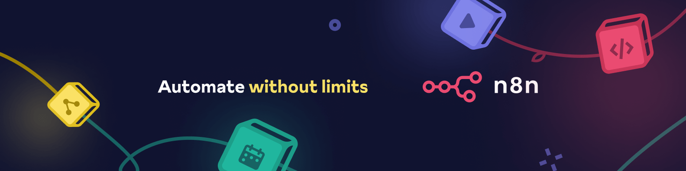

# n8n-nodes-aws-sqs-full



**Complete AWS SQS integration for n8n workflow automation**

[](https://www.npmjs.com/package/n8n-nodes-aws-sqs-full)
[](https://github.com/adejaimejr/n8n-nodes-aws-sqs-full/blob/main/LICENSE)
[](https://www.npmjs.com/package/n8n-nodes-aws-sqs-full)
[](https://n8n.io/integrations/community-nodes/)

A comprehensive AWS SQS community node package for n8n that provides complete queue workflow automation with three essential nodes: Send, Delete, and Trigger operations.

## Features

- **Send Messages**: Send messages to SQS queues with automatic queue discovery
- **Delete Messages**: Delete messages from SQS queues efficiently  
- **Trigger Workflows**: Monitor queues and trigger workflows when messages arrive
- **FIFO Support**: Full support for FIFO queues with Message Group ID and Deduplication ID
- **Message Attributes**: User-friendly interface for custom message attributes
- **Native AWS Credentials**: Uses n8n's built-in AWS credential system
- **Error Handling**: Robust error handling with continue-on-fail support
- **Production Ready**: Optimized for production workloads

## Installation

### Via n8n Community Nodes (Recommended)

1. Go to **Settings** → **Community Nodes** in your n8n instance
2. Click **Install** and enter: `n8n-nodes-aws-sqs-full`
3. Click **Install** and wait for the installation to complete

### Via npm

```bash
npm install n8n-nodes-aws-sqs-full
```

## Requirements

- n8n version 0.198.0 or higher
- Node.js 16.0.0 or higher
- AWS account with SQS access

## Quick Start

### AWS Credentials Setup

1. Go to **Settings** → **Credentials** in n8n
2. Click **Add Credential** and select **AWS**
3. Configure your AWS credentials:
   - **Access Key ID**: Your AWS access key
   - **Secret Access Key**: Your AWS secret key
   - **Region**: Your AWS region (e.g., `us-east-1`)

### Basic Usage

#### Sending Messages

```json
{
  "queue": "https://sqs.us-east-1.amazonaws.com/123456789012/my-queue.fifo",
  "sendInputData": true,
  "messageGroupId": "order-processing",
  "messageDeduplicationId": "order-123456"
}
```

#### Deleting Messages

```json
{
  "queueUrl": "https://sqs.us-east-1.amazonaws.com/123456789012/my-queue",
  "receiptHandle": "AQEBwJnKyrHigUMZj6rYigCgxlaS3SLy0a..."
}
```

#### Triggering on Messages

```json
{
  "queueUrl": "https://sqs.us-east-1.amazonaws.com/123456789012/my-queue",
  "pollingInterval": 30,
  "maxMessages": 10,
  "deleteAfterProcessing": true
}
```

## Available Nodes

### AWS SQS Send

Send messages to SQS queues with comprehensive configuration options.

**Key Parameters:**
- Queue selection from dropdown (auto-loaded from AWS)
- Send Input Data option for workflow integration
- Message Attributes with Name/Value/Type interface
- FIFO queue support with Message Group ID and Deduplication ID
- Delay message delivery (0-900 seconds)

### AWS SQS Delete

Delete messages from SQS queues after processing.

**Key Parameters:**
- Queue URL (full SQS queue URL)
- Receipt Handle (from received message)

### AWS SQS Trigger

Monitor SQS queues and trigger workflows when messages arrive.

**Key Parameters:**
- Queue URL for monitoring
- Polling interval (configurable)
- Maximum messages per poll
- Auto-delete after processing option

## Use Cases

### Order Processing Pipeline

```json
{
  "nodes": [
    {
      "name": "Order Created",
      "type": "n8n-nodes-base.webhook"
    },
    {
      "name": "Send to Queue",
      "type": "n8n-nodes-aws-sqs-full.awsSqsFullSend",
      "parameters": {
        "queue": "https://sqs.us-east-1.amazonaws.com/123456789012/orders.fifo",
        "sendInputData": true,
        "messageGroupId": "orders"
      }
    }
  ]
}
```

### Message Processing Workflow

```json
{
  "nodes": [
    {
      "name": "Receive Message",
      "type": "n8n-nodes-base.awsSqs"
    },
    {
      "name": "Process Message", 
      "type": "n8n-nodes-base.function"
    },
    {
      "name": "Delete Message",
      "type": "n8n-nodes-aws-sqs-full.awsSqsFullDelete",
      "parameters": {
        "queueUrl": "{{$node['Receive Message'].json.queueUrl}}",
        "receiptHandle": "{{$node['Receive Message'].json.receiptHandle}}"
      }
    }
  ]
}
```

## AWS IAM Permissions

Your AWS user needs the following permissions:

```json
{
  "Version": "2012-10-17",
  "Statement": [
    {
      "Effect": "Allow",
      "Action": [
        "sqs:SendMessage",
        "sqs:DeleteMessage", 
        "sqs:ReceiveMessage",
        "sqs:ListQueues",
        "sqs:GetQueueAttributes"
      ],
      "Resource": "arn:aws:sqs:*:*:*"
    }
  ]
}
```

## Configuration

### Message Attributes

Use the user-friendly interface to add custom message attributes:

| Field | Type | Description |
|-------|------|-------------|
| Name | string | Attribute name |
| Value | string | Attribute value |
| Type | string | Data type (String, Number, Binary) |

### FIFO Queues

For FIFO queues, ensure you provide:
- **Message Group ID**: Required for FIFO queues
- **Message Deduplication ID**: Optional, auto-generated if not provided

### Error Handling

All nodes support n8n's standard error handling:
- Enable "Continue on Fail" to handle errors gracefully
- Use error outputs to build robust workflows
- Monitor execution logs for troubleshooting

## Development

### Build from Source

```bash
# Clone the repository
git clone https://github.com/adejaimejr/n8n-nodes-aws-sqs-full.git

# Install dependencies
npm install

# Build the project
npm run build

# Run tests
npm test
```

### Project Structure

```
n8n-nodes-aws-sqs-full/
├── nodes/
│   ├── AwsSqsDelete/
│   ├── AwsSqsSend/
│   └── AwsSqsTrigger/
├── dist/
├── package.json
└── README.md
```

## Resources

- [AWS SQS Documentation](https://docs.aws.amazon.com/sqs/)
- [n8n Community Nodes](https://n8n.io/integrations/community-nodes/)
- [n8n Documentation](https://docs.n8n.io/)
- [Community Forum](https://community.n8n.io/)

## Support

Need help? Join our community:

- [GitHub Issues](https://github.com/adejaimejr/n8n-nodes-aws-sqs-full/issues)
- [n8n Community Forum](https://community.n8n.io/)

## FAQ

**Q: Can I use this with FIFO queues?**  
A: Yes, all nodes work with both Standard and FIFO SQS queues.

**Q: How does automatic queue loading work?**  
A: The Send node automatically loads all queues from your AWS account using configured credentials.

**Q: What happens if a message operation fails?**  
A: The node will return an error, but you can enable "Continue on Fail" to handle this gracefully.

**Q: Is there a limit to delay seconds?**  
A: AWS SQS supports delays from 0 to 900 seconds (15 minutes).

## Contributing

We welcome contributions! Please see our [Contributing Guide](CONTRIBUTING.md) for details.

Found a bug 🐛 or have a feature idea? [Create an issue](https://github.com/adejaimejr/n8n-nodes-aws-sqs-full/issues).

## License

This project is licensed under the MIT License - see the [LICENSE](LICENSE) file for details.

## About

Created by [Adejaime Junior](https://github.com/adejaimejr) for the [n8n community](https://community.n8n.io/).


